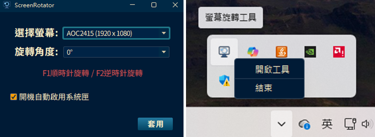

# ScreenRotator 螢幕旋轉工具

ScreenRotator 是一款簡易方便的 Java 螢幕旋轉工具，讓你在 Windows 系統中使用快捷鍵快速切換螢幕方向。

## ✨ 功能簡介

某些顯示卡（例如 AMD）預設不支援使用快捷鍵來旋轉螢幕。

此工具提供一個常駐系統托盤的程式，具以下功能：

- 使用快捷鍵來旋轉螢幕
- 自動偵測所有螢幕
- 系統托盤圖示管理，即開即用
- 已打包為 Windows 可執行檔，無需安裝 Java 即可直接使用

## 🖥️ 系統需求

- Windows 10 / 11
- 64 位元作業系統
- 無需另外安裝 Java（已內建 Runtime）

## 🧰 安裝與使用

你可以直接執行打包好的 Windows `.exe` 應用程式：

1. 前往 [Releases](https://github.com/yungyun351/screen-rotator/releases/latest)下載最新版本的 `ScreenRotator`。
2. 解壓縮後執行 `ScreenRotator.exe`。
3. 應用程式會顯示在系統托盤，點擊開啟功能視窗。
4. 開啟視窗後會自動啟用快捷鍵功能，可根據需求使用UI介面或是快捷鍵來旋轉螢幕。
5. 點擊系統托盤上的結束按鈕來完全關閉程式。

## 📄 授權與聲明

本軟體為個人開發工具，僅供學習與個人使用。  

---

© Martin T. Studio
